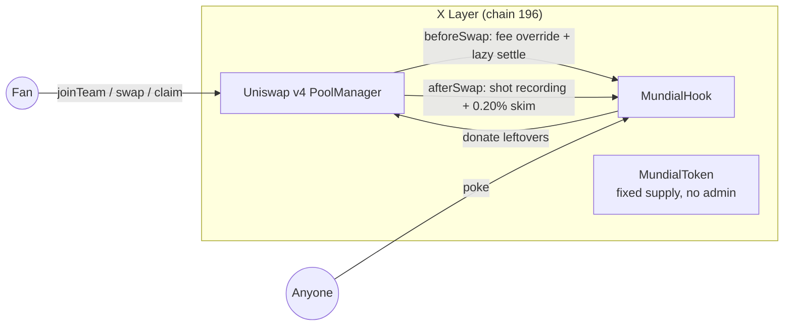

# ⚽ MUNDIAL — the pool that plays the World Cup

**A Uniswap v4 Hook on X Layer that turns one liquidity pool into a fully on-chain 8-team knockout tournament.** Trading *is* the game: every swap by a pledged fan is a shot on goal, volume scores goals, the bracket resolves itself, and champion fans claim a pot skimmed from their own trades.

Built for the **Hook × World Cup** campaign (OKX × X Layer × Uniswap v4, Jun 11 – Jul 12 2026).

> **No owner. No oracle. No randomness. No upgradeability.** The entire tournament — kickoffs, goals, golden goals, penalties, bracket progression, payouts — is deterministic on-chain logic driven purely by swaps and timestamps.

## How the game works

1. **Pledge** — call `joinTeam(seed)` once, irreversibly, for any of 8 still-alive teams (Argentina, France, Brazil, England, Spain, Germany, Portugal, Netherlands).
2. **Play** — swap in the pool. If your team is playing its match *right now*, your swap is a **shot**: its currency1 volume accrues to your team. Every `goalThreshold` of volume = **1 goal**.
3. **Match resolution** (all lazy — settled by the next swap or a public `poke()`):
   - Lead at full time → **win**.
   - Tied → **extra time, sudden death**: first goal is a **golden goal** and settles instantly, mid-swap.
   - Still tied at ET end → **penalties**: more shots (swap count) wins.
   - Total deadlock → lower **seed** advances (deterministic, no randomness).
4. **Bracket** — QF → SF → Final, standard single-elimination, fully on hook storage.
5. **Win** — champion-team fans `claim()` a pro-rata share (by their traded volume) of the **Champions Pot**: a 0.20% skim taken only from fan swaps. 30-day claim window, then `sweepToLPs()` donates leftovers to the pool's LPs.

## Fee tiers (dynamic-fee pool)

| State | LP fee |
|---|---|
| Neutral swapper | 0.50% |
| Fan of an alive team | 0.25% |
| Fan whose team is playing **live** | 0.15% |
| Fan swapping in **golden-goal extra time** | 0.10% |

Being a fan is cheaper. Playing is cheapest. The hook overrides the fee per-swap via `OVERRIDE_FEE_FLAG`.

## Architecture



- [src/MundialHook.sol](src/MundialHook.sol) — implements `IHooks` directly (BaseHook was removed from v4-periphery main; we self-validate permissions with `Hooks.validateHookPermissions` in the constructor). Flags: `afterInitialize | beforeSwap | afterSwap | afterSwapReturnDelta`.
- [src/MundialToken.sol](src/MundialToken.sol) — minimal solmate ERC20, 100M fixed supply, zero privileges.
- Single pool binding: `afterInitialize` rejects static-fee pools and any second pool.

## Trust model & security notes

- **Zero admin surface**: no owner, pauser, or upgrade path anywhere.
- **Fan attribution uses `tx.origin`** — a deliberate, documented choice so routers/aggregators (incl. the OKX Wallet router path) attribute swaps to the human. Contracts/smart accounts simply get neutral treatment; there is no approval-based risk since `tx.origin` is never used for authorization of funds, only game scoring.
- **Skim** follows the canonical FeeTakingHook pattern (`afterSwapReturnDelta`, take on the unspecified currency), CEI everywhere, claim flag set before transfer.
- **Bounded loops**: `_sync()` settles at most 7 matches; no unbounded iteration.
- Full threat model in [docs/SPEC.md](docs/SPEC.md).

## Build & test

```bash
git clone --recurse-submodules <repo>
forge build
forge test          # 38 tests + 3 fuzz suites (512 runs each)
forge test --match-contract MundialDemo -vv   # narrated end-to-end tournament
```

## Deploy (X Layer)

```bash
export XLAYER_RPC_URL=https://rpc.xlayer.tech
export PRIVATE_KEY=0x...
export POOL_MANAGER=0x360e68faccca8ca495c1b759fd9eee466db9fb32
# optional: QUOTE_TOKEN (default native OKB), KICKOFF, REGULATION, EXTRA_TIME, BREAK_TIME, GOAL_THRESHOLD

forge script script/DeployMundial.s.sol --rpc-url xlayer --broadcast
# then seed liquidity (ERC20 pair) via:
forge script script/SeedLiquidity.s.sol --rpc-url xlayer --broadcast
```

The deploy script mines a CREATE2 salt (`HookMiner`) so the hook address encodes its permission flags, deploys token + hook, and initializes the dynamic-fee pool at 1:1.

### Deployed addresses (X Layer mainnet)

| Contract | Address |
|---|---|
| MundialToken | _pending deploy_ |
| MundialHook | _pending deploy_ |
| PoolManager | `0x360e68faccca8ca495c1b759fd9eee466db9fb32` |

## Docs

- [docs/RUNBOOK.md](docs/RUNBOOK.md) — **master launch runbook** (single source of truth for deployment & submission).
- [docs/EVIDENCE.md](docs/EVIDENCE.md) — verified campaign rules, competitive landscape, gap analysis, concept selection.
- [docs/SPEC.md](docs/SPEC.md) — PRD, interfaces, threat model.
- [docs/PITCH.md](docs/PITCH.md) — judge-facing pitches (10 → 100 words + technical).
- [docs/SUBMISSION.md](docs/SUBMISSION.md) · [docs/FORM.md](docs/FORM.md) — submission plan and form answer sheet.
- [docs/BRAND.md](docs/BRAND.md) · [docs/ASSETS.md](docs/ASSETS.md) · [docs/VOICE.md](docs/VOICE.md) · [docs/VIDEO.md](docs/VIDEO.md) · [docs/SOCIAL.md](docs/SOCIAL.md) — brand, image prompts, voice-over, video production, social launch.
- [deployments/xlayer.json](deployments/xlayer.json) — machine-readable deployment record.

> Mundial is an independent project built for the Hook × World Cup campaign on X Layer. It is not affiliated with or endorsed by FIFA, any football federation, Uniswap Labs, OKX, or X Layer. Not financial advice; participation involves risk of loss.

## License

MIT
