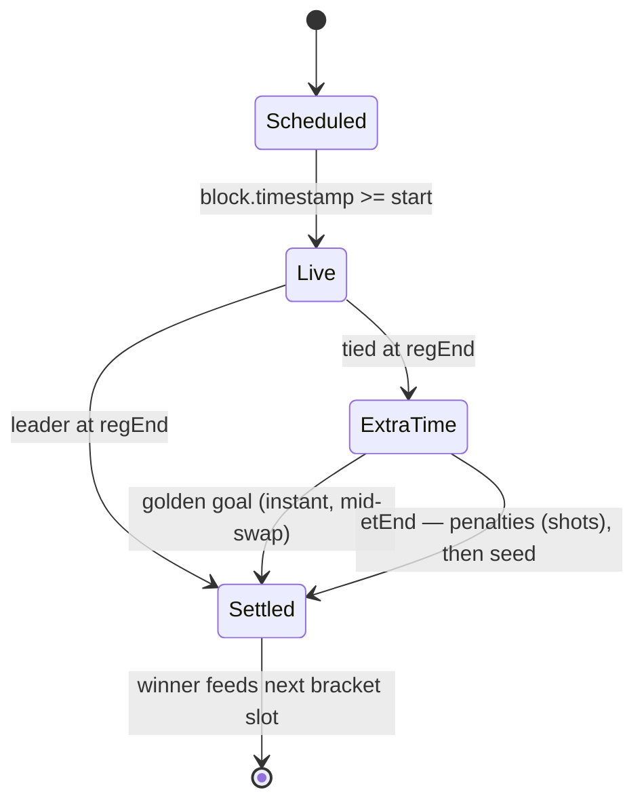

# Mundial — PRD, Architecture & Threat Model

## 1. Product requirements

### Goal
One Uniswap v4 dynamic-fee pool on X Layer that hosts a complete, trustless 8-team knockout World Cup, where trading is the sole game input, maximizing judged criteria: code quality, WC creativity, on-chain interactions.

### Functional requirements
- **FR1 Pledge**: any EOA may `joinTeam(seed)` exactly once, for a team not yet eliminated. Irreversible.
- **FR2 Schedule**: 7 matches (4 QF, 2 SF, 1 Final) in fixed slots; slot *i* starts at `kickoff + i*(regulation+extraTime+breakTime)`.
- **FR3 Shots & goals**: during a live match, a swap by a fan of a playing team records a shot; team volume (currency1 leg, gross) ÷ `goalThreshold` = goals.
- **FR4 Resolution** (lazy, via any swap or public `poke()`):
  1. Lead at regulation end → win.
  2. Tied → sudden-death ET; first goal (golden goal) settles instantly.
  3. Tied at ET end → penalties = more shots.
  4. Still tied → lower seed advances.
- **FR5 Fees**: per-swap LP fee override — neutral 0.50%, alive fan 0.25%, live-match fan 0.15%, golden-goal ET fan 0.10%.
- **FR6 Pot**: 0.20% skim on fan swaps only (unspecified currency), accumulated as `pot0/pot1`.
- **FR7 Claims**: champion-team fans claim pro-rata by personal traded volume (`caps/teamCaps`), 30-day window.
- **FR8 Sweep**: after the window (or immediately if champion has zero caps), anyone triggers `sweepToLPs()` → `donate()` to in-range LPs.
- **FR9 Single pool**: hook binds to exactly one dynamic-fee pool at `afterInitialize`; rejects others.

### Non-functional requirements
- No owner, oracle, randomness, or upgradeability.
- All loops bounded (≤7 matches). No external calls except PoolManager.
- Solidity 0.8.26, Cancun; full Foundry test + fuzz coverage.

## 2. Interfaces

```solidity
// Game
function joinTeam(uint8 seed) external;           // one-time pledge
function poke() external;                          // settle any due matches
function claim() external;                         // champion fans, pro-rata
function sweepToLPs() external;                    // post-window donation

// Views
function getMatch(uint8 id) external view returns (Match memory);
function matchTimes(uint8 id) external view returns (uint64 start, uint64 regEnd, uint64 etEnd);
function goalsOf(uint8 matchId, bool teamA) external view returns (uint64);
function champion() external view returns (uint8);
function pot0() / pot1() external view returns (uint256);

// Hook callbacks used: afterInitialize, beforeSwap, afterSwap (+ returnDelta)
```

**Constructor**: `(IPoolManager, bytes32[8] teamNames, uint64 kickoff, uint64 regulation, uint64 extraTime, uint64 breakTime, uint256 goalThreshold)` — validates schedule and threshold, self-checks hook-address flags via `Hooks.validateHookPermissions`.

## 3. State machine



Bracket wiring: `m0,m1 → m4`, `m2,m3 → m5`, `m4,m5 → m6 (final)`. `finalizedAt` set when the final settles; claim window = `finalizedAt + 30 days`.

## 4. Threat model

| # | Threat | Mitigation |
|---|---|---|
| T1 | Admin rug / parameter manipulation | No privileged roles exist. All parameters immutable at construction. |
| T2 | Oracle manipulation | No oracle. Only inputs: swaps + `block.timestamp`. |
| T3 | Randomness manipulation | No randomness. All tiebreaks deterministic (goals → shots → seed). |
| T4 | Reentrancy on `claim` | CEI: `claimed[fan] = true` before transfer; transfer via Currency library. |
| T5 | Reentrancy on `sweepToLPs` | Runs inside `poolManager.unlock` callback; `onlyPoolManager` on `unlockCallback`; balance snapshot before donate. |
| T6 | Fake pool / static-fee pool | `afterInitialize` requires `fee == DYNAMIC_FEE_FLAG` and rejects any second pool; every callback checks poolId. |
| T7 | Hook callback spoofing | All callbacks `onlyPoolManager`; unused `IHooks` entries revert `HookNotImplemented`. |
| T8 | Wrong hook address flags | Constructor `Hooks.validateHookPermissions` self-check; CREATE2 mined salt; deploy script asserts address match. |
| T9 | `tx.origin` phishing concern | `tx.origin` used **only** for game attribution (shots/caps/pledge lookup), never for asset authorization. A malicious contract can at most take a shot *for the victim's own pledged team* while paying the swap itself. Documented limitation: smart-account users are treated as neutral. |
| T10 | Wash trading to score goals | Wash traders pay 0.15–0.25% LP fees + 0.20% skim per swap — goals cost real money that funds LPs and the pot; the design converts manipulation into protocol revenue. Campaign volume rules (OKX frontend only) further gate prize-volume gaming. |
| T11 | Griefing via `poke()` | `poke` only advances the deterministic clock; calling it is always safe and permissionless. |
| T12 | Overflow | Solidity 0.8 checked math; the two `uint128` casts are provably in-range (from `abs(int128)`), annotated for forge-lint. |
| T13 | DoS via unbounded loops | `_sync` bounded to 7 matches; claim/sweep are O(1). |
| T14 | Stuck funds | Any pot residue after the claim window is donated to LPs; if champion has zero caps, sweep is enabled immediately. |
| T15 | Native OKB handling | `receive()` payable; `_settleCurrency` uses `settle{value}` for native legs. |

### Security checklist
- [x] No `delegatecall`, `selfdestruct`, assembly asset handling
- [x] No external calls except PoolManager
- [x] CEI on all value transfers
- [x] All state-mutating externals covered by tests, incl. revert paths
- [x] Fuzz: goal math, claim conservation (Σ claims ≤ pot), tournament termination
- [x] forge-lint clean (with two documented safe-cast annotations)

## 5. Testing summary

38 tests + narrated demo, all passing (`forge test`): permissions/flag validation, constructor reverts, pool-binding rejections, `onlyPoolManager` guards, pledge paths, all four fee tiers (comparative net-output assertions), gross-volume scoring incl. skim math, every settlement path (regulation, golden goal, penalties, seed deadlock, full-tournament poke, lazy settlement), claim pro-rata + all reverts, sweep guards + donation + zero-caps edge, 3 fuzz properties at 512 runs (2000 in `ci` profile).
